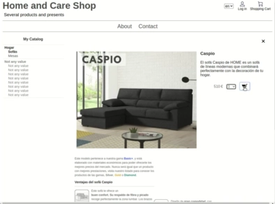

=> :boom: [Demo Shop](https://youronlineshop.net/sample/)

:wrench: Admins (usr/password) => webadmin/webadmin, productsadmin/productsadmin

=> :information_desk_person: [Video Demo](https://youtu.be/PD_olszbGWA)
<table>
  <tr>
    <td>
    <a href="https://youtu.be/PD_olszbGWA"></a>
    </td>
  </tr>
</table>

## :cactus: About

This is the source code of an application for building an e-commerce which can be modified from the browser to become a custom e-commerce or online store. It is built in javascript with Node.js and Mongodb, and it has no dependencies.

:globe_with_meridians: https://youronlineshop.net

:trophy: Awards:


## :ok_hand: Main features:

- :thumbsup: Easy shop edition
- :runner: Quick purchase process
- :heart: Website pages (About, Contact, etc.)
- :art: Appearance editing through layouts files
- :sparkles: [Multi shop](docs/multishopguide.md)

## :zap: Installation

1. Get the source files.
2. Install Node and Mongodb when needed.
3. Edit the Mongodb url when needed (server/context__main/cfg.mjs).
4. Open your terminal in the source top folder and type:
```
npm install 
npm start
```
5. The server is running now. Continue in browser as prompt tells.

**Note:** [Master branch](https://github.com/petazeta/youronlineshop/tree/master) contains the latest implementation, [Development branch](https://github.com/petazeta/youronlineshop/tree/development) contains the last changes, and [The last stable release](https://github.com/petazeta/youronlineshop/releases/tag/v5.0) is the most suitable for use in production.

## :ghost: Support

It works on Node v.16 and Mongodb v.4. We cannot guarantee it would work on a different version.

For any issues, please write to: melchorherrera@gmail.com. We will gladly appreciate any bug reports.


## :rocket: Getting started

Once Your Online Shop is installed, you can open your browser at the correspondent url address. Lets log in with some of the admin users to make changes: user webadmin for web content and productsadmin for catalog content. Other operations can be done by user systemadmin, and to check customer orders, log in with ordersadmin.

After editing some content, press Intro or click outside the editable area to save changes.

To edit some features from the checkout process, you should log in with the systemadmin user and make an order as if you were a customer. Once you get to the checkout step, you should be able to edit the checkout options.

Some other configuration can be done by editing some cfg files.


## :mortar_board: Documentation

=> :green_book: [Check Documentation](docs/overview.md)


## :art: Skins

Y.O.S. system has layouts files that can be modified (HTML and CSS) to change its appearance. You can find these files in the layouts' folder.


## :bulb: Extensions

There is already one extension included with in the source: dbmanager. You can use it to manage database content directly. Run it by following the instructions at: "utils/dbmanager/README.txt".


## :eight_spoked_asterisk: More

=> :family: [Y.O.S. main advantages and more](docs/marketing.md)

Please consider giving us a star :star: !!!
